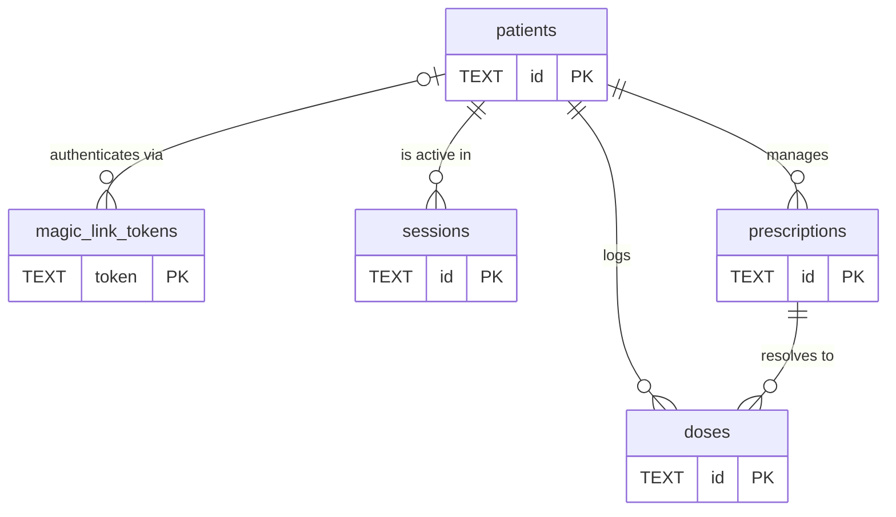
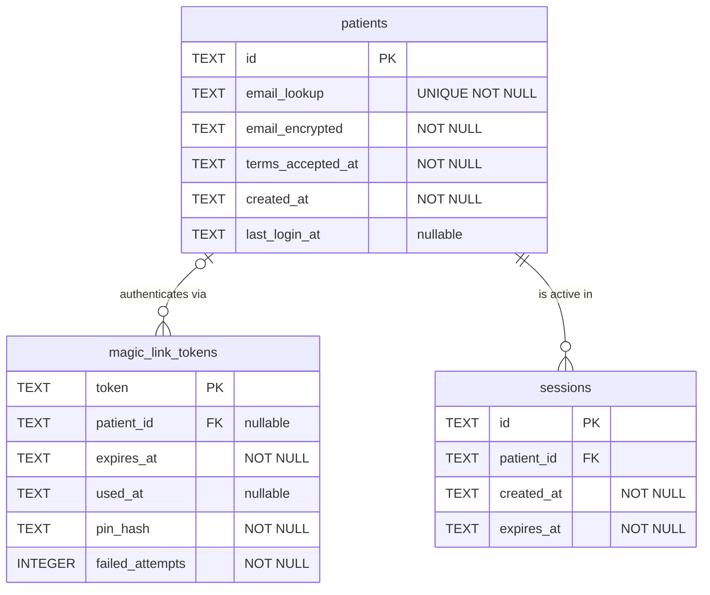
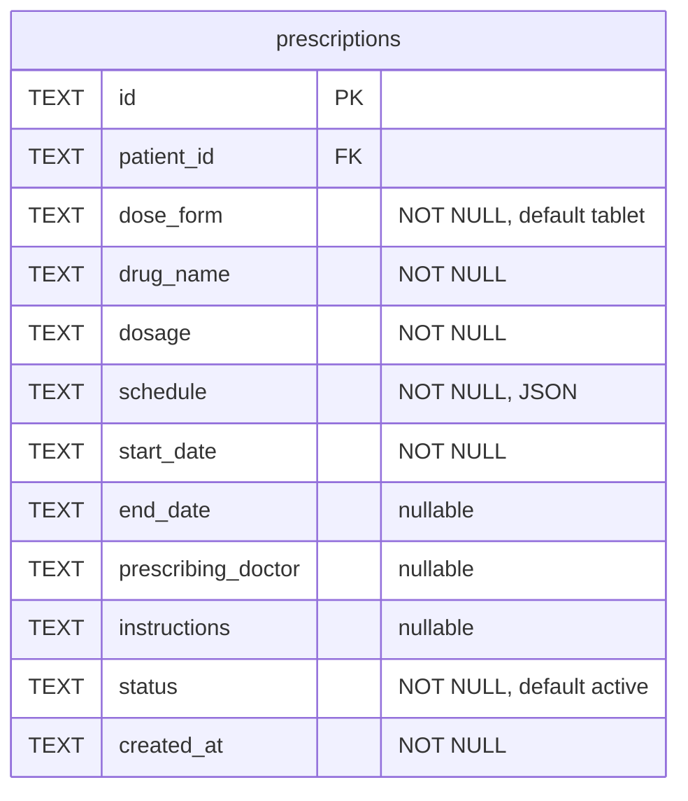
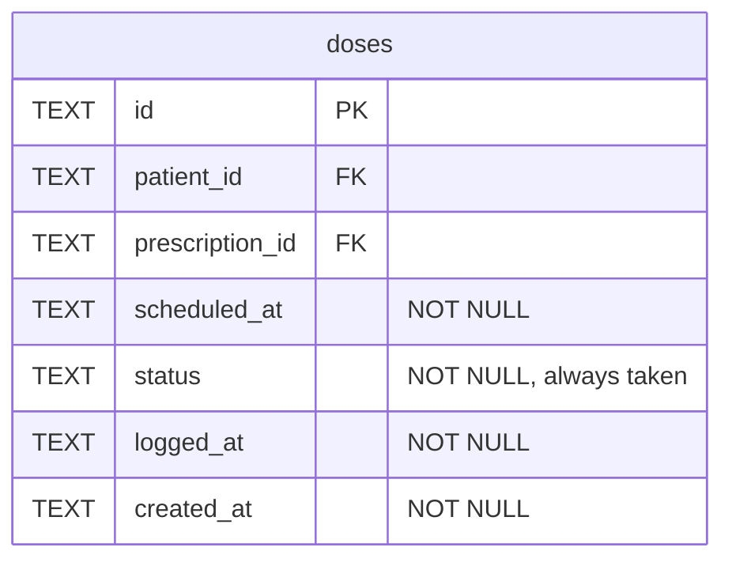

# Pillbug

A web app that helps patients track and follow their prescribed medication schedules, with a shareable view for healthcare providers.

## Design Principles

**Privacy by Default**:
The app discloses as little information as necessary, and the burden is always on revealing rather than concealing — like a spring-hinged door that closes itself. Patients should never have to take an explicit action to hide something sensitive; sensitive information should be hidden unless the Patient actively chooses to show it.

This principle applies at every layer:

- _Auth_: auth endpoints never confirm whether an email address is registered (email enumeration protection), because knowing someone uses a medication-tracking app is itself sensitive.
- _Prescription visibility_: a Patient should be able to use the app with someone looking over their shoulder without sensitive Prescriptions being visible by default. See Prescription visibility in Flagged ambiguities.

When designing a new feature, ask: what is the minimum information needed here, and what is the least-surprising default for a Patient who hasn't thought about privacy?

## Language

**Operator**:
The person who runs the Pillbug deployment — not a Patient. Has access to the Admin Panel to view aggregate statistics about the deployment. Authenticates via Cloudflare Access (Zero Trust), not the Patient magic-link flow. There is no Operator record in the database; the identity is managed entirely by Cloudflare.
_Avoid_: Admin user, superuser, staff

**Admin Panel**:
A restricted page (`/admin`) accessible only to the Operator. The Worker validates the Cloudflare Access JWT, queries D1, and returns a server-rendered HTML page showing aggregate counts only — total registered Patients, unverified Patients, and active Sessions. Exposes no per-Patient data (no emails, no UUIDs, no Prescription data). Requests that bypass Cloudflare are rejected by the Worker itself.
_Avoid_: Dashboard, management console, back-office

**Patient**:
The person who takes medications and uses the app to manage their own schedule. Authenticates via a Verification Code sent by email.
_Avoid_: User, account, client

**Registration**:
The form a new Patient submits to create their account: entering their email address and explicitly accepting the Terms of Service and Privacy Policy. Submitting the form creates an Unverified Patient record, sends a Verification Code by email, and redirects the Patient to the Enter Code screen. Registration is complete at form submission — Verification is a separate subsequent event. Registration is a distinct screen from Login — not a silent side-effect of first login. Unverified Patient records that are not Verified within 7 days are hard-deleted by a daily cron job; Patients are informed of this window at registration time.
_Avoid_: Sign up, Onboarding (onboarding is a separate concept if it exists), Account creation
_Privacy_: The registration endpoint returns `{ ok: true, token: "..." }` whether the email is new or already registered (silently sending a login email in the latter case). Per Privacy by Default: confirming whether an email is registered reveals that someone uses a medication-tracking app, which is sensitive in itself.

**Verification**:
The event that activates a Patient's account — their first successful Verification Code entry, confirming they own the registered email address. Mechanically: `patients.last_login_at` transitions from `NULL` to a timestamp. A Patient who has registered but not yet verified is an **Unverified Patient**; they cannot use the app until Verification is complete. Subsequent Logins update `last_login_at` but are not Verification events.
_Avoid_: Email confirmation, Account activation, Email validation

**Verification Code**:
A 4-digit numeric code included in verification and login emails. Displayed prominently in the email; the Patient enters it on the Enter Code screen to create a session on the device of their choosing. The email also includes a pre-filled link (`/enter-code?token=<uuid>&pin=<code>`) that auto-submits the code on click — both paths go through the same endpoint. Valid for the same 20-minute window as the associated token. Stored as a hash in `magic_link_tokens.pin_hash`. After 5 failed entries the code is permanently locked for that token, including the in-email link.
_Avoid_: PIN, OTP, One-time password

**Enter Code Screen**:
The screen shown to the Patient after submitting the Registration or Login form, at `/enter-code?token=<uuid>`. The Patient enters their Verification Code from the email to create a session on the current device. The token in the URL identifies which Verification Code to validate against. The email also includes a pre-filled link that lands here with the code in the URL and auto-submits on arrival. After 5 failed entries the Verification Code is locked for that token — the in-email link is also blocked, since it carries the same code in the URL and resolves through the same endpoint. A locked Patient must request a new code from `/login`. Displays distinct messages for four token states: `expired` (token not found or past the 20-minute window), `invalid` (token exists but the Verification Code doesn't match), `used` (already redeemed — Patient is likely logged in on another device), and `locked` (5 failed code entries).
_Avoid_: Challenge screen, Verify screen, Check your email

**Prescription**:
A medication a clinician has directed the Patient to take on a schedule.
_Avoid_: Medication (too generic — doesn't imply a schedule or clinical directive), Task, Regimen Item

Fields: form factor (physical unit type: tablet / capsule / pill / other), drug name (free text with autocomplete), dosage (free text, e.g. "10 mg"), schedule (see **Schedule** — per-slot quantity lives here, not at the Prescription level), start date (required), end date (optional), prescribing Doctor (optional), instructions (optional free text), status (Active, Completed, Paused, or Discontinued).

Status values: **Active** (generating Reminders), **Completed** (reached end date), **Paused** (temporarily suspended, expected to resume), **Discontinued** (stopped early, will not resume).

A Prescription can be hard-deleted. Deletion is permanent and cascades to all associated Dose history.

**Prescription Detail**:
The read-only view of a single Prescription's information, accessible at `/prescriptions/:id`. Shows the drug name, strength, duration, form factor, and a summarized Schedule (dose times and per-slot quantities). Provides the entry point for editing (navigates to `/prescriptions/:id/edit`) and deleting a Prescription. Reached from the Prescription list (`/prescriptions`) and from the "View Details" link on each Scheduled Dose row in the Scheduled Dose List.
_Avoid_: Prescription view, Prescription summary, Prescription page

**Schedule**:
The set of clock-based times and per-slot quantities at which a Patient should take a Prescription, on specified days of the week.
_Avoid_: Recurrence, Timetable, Frequency

Fields: days (a map of day-of-week → list of dose-slot objects for that day).

Stored as JSON in the `schedule` column. Each day is keyed independently and maps to a list of objects with `time` (HH:MM) and `quantity` (number of physical units for that slot). Example: `{ "monday": [{ "time": "08:00", "quantity": 2 }], "friday": [{ "time": "08:00", "quantity": 1 }, { "time": "20:00", "quantity": 2 }] }`. Supporting different times and quantities per day.

**Doctor**:
A healthcare provider optionally associated with one or more Prescriptions. Private to each Patient. Required field: name. Optional fields: phone, address, email.
_Avoid_: Provider, Clinician, Physician

**Scheduled Dose**:
A Prescription's Schedule projected onto a specific calendar date and time — an expected dose instance that may or may not yet be backed by a recorded Dose. Scheduled Doses are derived, not stored; they exist as long as the Prescription is active and the date falls within its schedule.
_Avoid_: Pending dose, Upcoming dose, Dose slot

**Dose**:
A recorded instance of a Patient taking a Prescription at a specific time. Status is always `taken` — missed or ignored doses are not stored; their absence from the record is the signal.
_Avoid_: Administration, Intake, Log Entry
_Note_: "Dose" also refers to the prescribed amount (dosage) — use supporting context to disambiguate (e.g., "log a Dose", "your 8am Dose" vs. "dosage: 10mg").

**Reminder**:
A push notification sent to the Patient at a scheduled time prompting them to take a Prescription.
_Avoid_: Alert, Notification, Alarm

Resolution flow: Patient is asked "Did you take it?" (Yes / No). "Yes" logs a taken Dose. "No" presents a second screen: "Snooze" or "Ignore." "Ignore" logs a missed Dose.

**Snooze**:
A Patient action that defers a Reminder by 9 minutes (alarm clock convention), causing it to re-fire. Does not log a Dose.

**Pill Organizer**:
A physical multi-compartment container used by the Patient to pre-sort medications by day and time of day. The Patient configures their Pill Organizer's structure in the app (Compartments per day: 1, 2, or 4; span: 7-day or longer).
_Avoid_: Pill box, Dosette box, Medicine organizer, Weekly planner

**Compartment**:
A single physical slot in a Pill Organizer, identified by day and time of day (e.g., "Monday AM").
_Avoid_: Slot, Cell, Section

**Compartment Mapping**:
A saved Patient decision resolving how a Prescription's scheduled time maps to a specific Compartment when the mapping is ambiguous (e.g., 12:30am could be "late night" PM or "early morning" AM). Prompted inline during the first Fill Session that encounters the ambiguity, with an "Always do this" option to save for future sessions.
_Avoid_: Time assignment, Preference

**Fill Session**:
A guided, step-by-step workflow in which the Patient fills their Pill Organizer for the full span of the organizer (e.g., 7 days). Follows a prescription-by-prescription approach (one Prescription at a time across all Compartments, then move to the next). The Patient can optionally configure a recurring Reminder to prompt Fill Sessions. Workflow steps are provisional pending pharmacist or OT validation.

Steps: (1) Verification — for each active Prescription, the app calculates the required pill count and the Patient confirms Yes/No that they have enough. If No, the app flags a refill is needed but does not block the session. (2) Filling — prescription-by-prescription, the Patient places pills in the listed Compartments. The Patient can confirm each Compartment individually or mark all at once. Ambiguous Schedule-to-Compartment mappings are resolved inline when first encountered, with an option to save as a permanent Compartment Mapping.

If a Fill Session is interrupted and resumed, an Audit step precedes the remaining filling steps: the Patient confirms each previously completed Prescription is still accurate, and verifies no additional pills have been placed in those Compartments.

A completed Fill Session is recorded with a timestamp and which Prescriptions were flagged as needing a refill during verification.
_Avoid_: Packing, Loading, Preparation

**Prescription Suggestion**:
A URL encoding a proposed Prescription that a Doctor sends to a Patient (e.g. via email). Carries: drug name, dosage, instructions, and optionally an end date. Encoded as readable query params (e.g. `?drug=Metformin&dosage=500mg&instructions=Take+with+food`); a motivated Doctor or assistant can construct one by hand without the generator.

Visiting the link:

- **Logged-in Patient**: sees a pre-filled confirmation form. The Prescription is not created until the Patient confirms and fills in the remaining fields (Schedule, start date).
- **Not logged in** (Doctor previewing, or Patient not yet authenticated): sees a read-only preview of the Prescription data and a login link that preserves the current URL. After completing login, the Patient is returned to the same Prescription Suggestion URL and can confirm.

The link is reusable and not bound to a specific Patient. Requires no Pillbug account for the Doctor. Pillbug provides a public **Prescription Suggestion Generator** for constructing the URL.
_Avoid_: Prescription Link (too close to Share Link), Prescription Invite, Rx Template

**Prescription Suggestion Generator**:
A public form on Pillbug for constructing a Prescription Suggestion URL. Accessible without a Pillbug account. Accepts drug name, dosage, instructions, and optional end date, and produces a shareable URL the Doctor can send to a Patient.
_Avoid_: Rx tool, Link builder, Prescription creator

**Scheduled Dose List (Week View)**:
The Patient's home screen: a checklist of all Scheduled Doses for the current calendar week (Monday–Sunday), grouped under a heading per day. Shows Active Prescriptions only. Future Scheduled Doses (days not yet reached) are visible but not actionable — no pre-logging. Past unresolved Scheduled Doses remain actionable; the Patient can still log them retroactively. The Patient can navigate backward week-by-week to the Monday of the week containing their Registration date; forward navigation is blocked. Checking a Scheduled Dose's checkbox records a taken Dose at the actual current time; unchecking removes the Dose record. A Dose logged via Reminder resolution also resolves the corresponding Scheduled Dose here. Each Scheduled Dose row includes a "View Details" link navigating to the Prescription Detail for the corresponding Prescription.
_Avoid_: Home, Weekly view, Dose schedule, Medication checklist

**Adherence Record**:
A read-only view of a Patient's Prescriptions (active and completed), Dose history, and Fill Session history (including any refill flags raised), showing how consistently they have followed their prescribed schedule. Intended for sharing with a healthcare provider.
_Avoid_: Care Summary, Doctor View, Provider Page, Report, Medication History

**Share Link**:
A time-limited URL granting unauthenticated read-only access to a Patient's Adherence Record. Default expiry: 24 hours. Maximum expiry: 30 days. Can be revoked by the Patient at any time.
_Avoid_: Public link, Share URL

## Relationships

- A **Patient** has one or more **Prescriptions**
- A **Prescription** optionally belongs to one **Doctor**
- A **Prescription**'s **Schedule** generates **Reminders**
- When a **Prescription** with an end date expires, the Patient receives an end-of-course notification and the **Prescription** moves to completed status
- A **Reminder** results in a **Dose** (taken), a **Snooze** (deferred), or a dismissal (no Dose logged)
- A **Dose** can be logged retroactively from history, independent of a Reminder
- A **Patient** can generate a **Share Link** to grant read-only access to their **Adherence Record**
- A **Doctor** can generate a **Prescription Suggestion** link that a **Patient** confirms to create a **Prescription**
- A **Patient** optionally has one **Pill Organizer** with a configured structure (Compartments per day, span in days)
- A **Fill Session** covers the full span of the **Pill Organizer** and is recorded on completion

## Data Model

Current database tables (reflects applied migrations).

### Entity overview

### Auth tables

**patients**

| Column              | Description                                                                         |
| ------------------- | ----------------------------------------------------------------------------------- |
| `id`                | UUID primary key                                                                    |
| `email_lookup`      | HMAC of the email address — used for fast indexed lookups without storing plaintext |
| `email_encrypted`   | AES-GCM ciphertext of the email address — decrypted only for display                |
| `terms_accepted_at` | When the Patient accepted the Terms of Service at Registration                      |
| `created_at`        | When the Patient record was created                                                 |
| `last_login_at`     | Most recent successful login; `NULL` means the Patient is Unverified                |

**magic_link_tokens**

| Column            | Description                                                                                              |
| ----------------- | -------------------------------------------------------------------------------------------------------- |
| `token`           | Opaque token included in the Enter Code screen URL                                                       |
| `patient_id`      | Owning Patient; cascades on delete                                                                       |
| `expires_at`      | Token validity deadline (20-minute window from issue)                                                    |
| `used_at`         | When the token was successfully verified; `NULL` means unused                                            |
| `pin_hash`        | Hash of the 4-digit Verification Code; set at token creation                                             |
| `failed_attempts` | Count of incorrect Verification Code submissions; the code is locked (returns `locked`) when this hits 5 |

**sessions**

| Column       | Description                                               |
| ------------ | --------------------------------------------------------- |
| `id`         | Opaque session ID stored in the `session` HttpOnly cookie |
| `patient_id` | Owning Patient; cascades on delete                        |
| `created_at` | When the session was established                          |
| `expires_at` | Session expiry (30-day TTL from creation)                 |

### Prescriptions

| Column               | Description                                                                                                                                                                                                              |
| -------------------- | ------------------------------------------------------------------------------------------------------------------------------------------------------------------------------------------------------------------------ |
| `id`                 | UUID primary key                                                                                                                                                                                                         |
| `patient_id`         | Owning Patient; cascades on delete                                                                                                                                                                                       |
| `dose_form`          | Physical form of the unit: `tablet`, `capsule`, `pill`, or `other`; defaults to `tablet`                                                                                                                                 |
| `drug_name`          | Free-text drug name (e.g., "Metformin")                                                                                                                                                                                  |
| `dosage`             | Free-text prescribed amount (e.g., "500mg", "two 20mg tablets")                                                                                                                                                          |
| `schedule`           | JSON map of day-of-week → list of `{ time: HH:MM, quantity: number }` objects (e.g., `{ "monday": [{ "time": "08:00", "quantity": 2 }] }`); per-slot quantity replaces the former prescription-level `dose_count` column |
| `start_date`         | `YYYY-MM-DD` date from which Scheduled Doses begin generating                                                                                                                                                            |
| `end_date`           | `YYYY-MM-DD` date after which no further Scheduled Doses generate; `NULL` = open-ended                                                                                                                                   |
| `prescribing_doctor` | Free-text doctor name; `NULL` if not provided                                                                                                                                                                            |
| `instructions`       | Free-text Patient-facing directions (e.g., "Take with food"); `NULL` if not provided                                                                                                                                     |
| `status`             | `active`, `completed`, `paused`, or `discontinued`; defaults to `active`                                                                                                                                                 |
| `created_at`         | When the Prescription record was created                                                                                                                                                                                 |

### Doses

| Column            | Description                                                                                                                                                                                                         |
| ----------------- | ------------------------------------------------------------------------------------------------------------------------------------------------------------------------------------------------------------------- |
| `id`              | UUID primary key                                                                                                                                                                                                    |
| `patient_id`      | Owning Patient; cascades on delete                                                                                                                                                                                  |
| `prescription_id` | The Prescription this Dose resolves; cascades on delete                                                                                                                                                             |
| `scheduled_at`    | The local clock time of the Scheduled Dose slot expressed as a UTC-format timestamp (e.g., `2024-03-11T08:00:00Z`); the date and time components come from the Prescription's schedule, not from UTC conversion     |
| `status`          | Currently always `taken` — only taken Doses are recorded; a missing row means the dose was missed or ignored                                                                                                        |
| `logged_at`       | When the Patient tapped the checkbox, as recorded by the server at request time. For retroactive logging this reflects when the Patient logged it, not necessarily when they ingested the medication                |
| `created_at`      | When the database row was written. Currently always identical to `logged_at` since both are set server-side on the same request — the distinction would matter if the Patient could supply their own ingestion time |

## Flagged ambiguities

- "Medication" vs "Prescription" — resolved: use **Prescription** to capture that the item is clinically directed and schedule-bearing, not just a drug name.
- Exercises / OT activities are explicitly out of scope for now, though the concept of a **Prescription** is intentionally broad enough to accommodate them later.
- Refill reminders are explicitly out of scope for v1. Pill count tracking introduces ongoing maintenance burden (entering counts, updating after refills) better suited to a later iteration.
- Complex schedules (birth control cycles, every-N-hours dosing) are out of scope for v1 — Schedule supports clock-time-based daily/weekly patterns only.
- **Prescription visibility** — resolved. The `/prescriptions` screen loads and displays the full list on mount — no reveal gate. Navigating to that screen is itself an intentional reveal act (see ADR-0016). The home screen (Scheduled Dose List) retains its reveal gate — it is visible during normal app use and a Patient may leave it open with a bystander nearby.
- **Partial dosage logging** — unresolved. A Patient may take a different amount than prescribed: a single 40mg tablet when 15mg was scheduled, or one of two prescribed 20mg tablets due to running out. The current Dose schema has no field for actual quantity or actual dosage taken — it records only whether the scheduled slot was fulfilled. If this use case is supported in future, a `quantity_taken` or `actual_dosage` field on `doses` would be needed, and the Prescription's `dosage` field (currently free text) may need to become structured to allow comparison.
- **Absence vs. deliberate miss** — unresolved. A missing Dose record means the Patient did not record a taken Dose, but it does not distinguish between "dose was missed," "Patient forgot to log it," or "Patient never opened the app." A future feature could allow a Patient to explicitly mark a Scheduled Dose as missed, which would create a record with a distinct status — allowing the Adherence Record to separate confirmed misses from unrecorded slots.
- **Per-day dose times** — unresolved. The Schedule data model supports different times per day (e.g., Mon/Wed/Fri at 9am, Tue/Thu at 2pm), but the Add/Edit Prescription form assigns the same set of times to every selected day. The common case — same time every day — is fully supported. Supporting per-day time variation would significantly complicate the schedule UI and is deferred until a Patient reports needing it.
