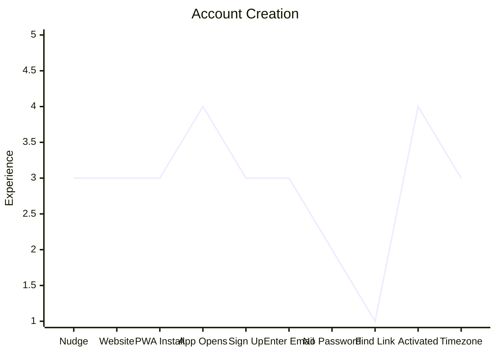

# Account Creation

> **Note:** This journey was written before the switch from magic link to Verification Code login. Stage 8 ("Find Link") and the key risk note reflect the old flow. The current flow asks the Patient to enter a 4-digit code instead of tapping a link. Stage 10 ("Timezone") reflects the mandatory timezone setup gate added after initial account creation.

| Stage          | Description                                                                |
| -------------- | -------------------------------------------------------------------------- |
| 1. Nudge       | Ian suggests trying the app; Denzel is willing but passive                 |
| 2. Website     | Denzel opens browser and gets to the site on Ian's instruction             |
| 3. PWA Install | Ian takes the phone and installs it; Denzel watches                        |
| 4. App Opens   | Denzel gets the phone back and opens the app for the first time            |
| 5. Sign Up     | Ian prompts him; Denzel starts the signup flow                             |
| 6. Enter Email | Familiar action, Denzel manages this                                       |
| 7. No Password | Denzel expected to create a password; doesn't understand what happens next |
| 8. Find Link   | Must leave app, find email (possibly in spam), tap magic link              |
| 9. Activated   | It worked; Denzel is back in the app and logged in                         |
| 10. Timezone   | App redirects to Settings; Denzel confirms his timezone and taps Save      |

**Key risk:** Stages 7–8 represent the sharpest drop in the experience. The passwordless flow is unfamiliar and the magic link step requires Denzel to context-switch to email, locate the message, and return — a high failure point for a non-tech-savvy user.

**Stage 10 note:** The timezone picker pre-selects the browser-detected timezone, so in most cases Denzel only needs to tap Save. The gate ensures the app always has a timezone before displaying dose schedules.
