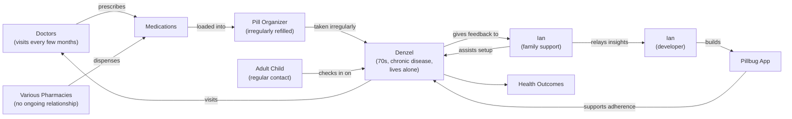

# Journey Maps

## Actor & Entity Map

## Entity Definitions

**Denzel** — Primary user. A man in his 70s managing chronic disease, living alone, and not tech-savvy. Currently takes medications as he remembers them rather than on a consistent schedule. Uses a pill organizer that is irregularly refilled.

**Doctors** — Denzel's medical care providers. He visits every few months. They prescribe his medications but have limited visibility into his day-to-day adherence.

**Various Pharmacies** — Where Denzel fills his prescriptions. He has no ongoing relationship with any particular pharmacist, so there is no trusted person in this role who knows his full medication picture.

**Medications** — The prescribed drugs Denzel is meant to take on a schedule defined by his doctors.

**Pill Organizer** — A physical artifact Denzel uses to sort medications by day. Currently refilled irregularly, contributing to missed or uncertain doses.

**Adult Child** — Denzel's adult child, who maintains regular contact and is part of his support network. Not a primary caregiver but an interested, involved party.

**Ian (family support)** — A member of Denzel's extended family who is helping him adopt Pillbug. Assists with setup and serves as a point of contact for questions and feedback from Denzel.

**Ian (developer)** — The developer of Pillbug. Receives insights relayed from Ian (family support) to inform product decisions. Represented separately to make the dual role explicit.

**Pillbug App** — The application being designed and built. Intended to support consistent medication adherence for users like Denzel.

**Health Outcomes** — The downstream result of consistent (or inconsistent) medication adherence. The ultimate measure of whether the experience succeeds.

---

## Experience Scope

Five discrete experiences are being mapped. Each may occur in a separate session.

| Experience                                            | Begins                                                                        | Ends                                                                  |
| ----------------------------------------------------- | ----------------------------------------------------------------------------- | --------------------------------------------------------------------- |
| [Account creation](account-creation.md)               | Ian introduces Pillbug to Denzel                                              | Denzel has an account and the app is on his phone                     |
| [Prescription setup](prescription-setup.md)           | Denzel or Ian decides to enter a medication                                   | That medication is saved with a schedule Denzel trusts                |
| [Prescription management](prescription-management.md) | Denzel has a new, changed, discontinued, or incompletely entered prescription | The app reflects Denzel's current medication list and he trusts it    |
| [Reminder interaction](reminder-interaction.md)       | A notification fires on Denzel's phone                                        | Denzel has taken or skipped the medication and the app knows about it |
| [Pill organizer fill session](pill-organizer-fill.md) | Denzel sits down to refill his organizer                                      | The organizer is correctly filled and matches what the app expects    |

---

## Map Format

Each experience is mapped as a separate chronological journey map with:

- **X-axis** — stages in chronological order
- **Y-axis** — emotional score 1–5 (1 = frustrated, 5 = delighted)
