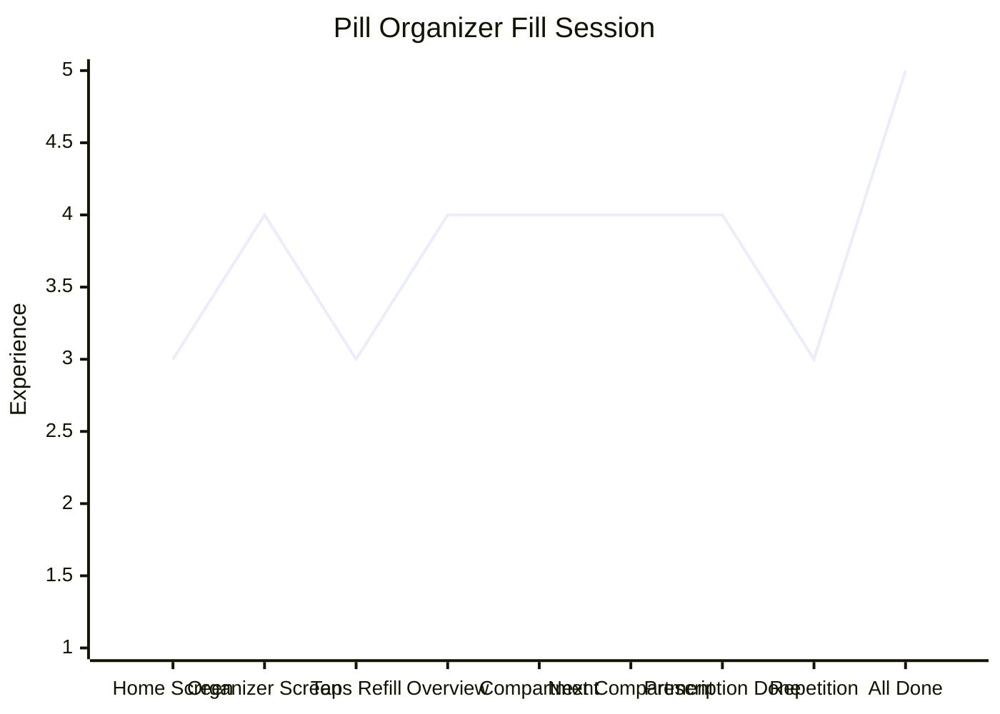

# Pill Organizer Fill Session

| Stage                      | Description                                                                    |
| -------------------------- | ------------------------------------------------------------------------------ |
| 1. Home Screen             | Taps pill organizer button                                                     |
| 2. Pill Organizer Screen   | Sees current status — how many pills should be remaining based on day and time |
| 3. Taps Refill             | Starts the fill session wizard                                                 |
| 4. Overview                | Sees total pills needed for this session; knows what's ahead                   |
| 5. Compartment Instruction | "Put 2 pills in Tuesday" — one clear task at a time                            |
| 6. Next Compartment        | Same pattern, building confidence                                              |
| 7. Prescription Complete   | Confirms done, asked if ready for the next prescription                        |
| 8. Repetition              | Works through remaining prescriptions; some fatigue but structured             |
| 9. All Done                | Animation plays; session complete                                              |

**Note:** The pill organizer screen (stage 2) also serves a mid-week use case — Denzel can check anytime during the week to see how many pills should be remaining based on the current day and time, without starting a fill session. This is a passive adherence check that requires no explicit action.

**Design strength:** The wizard structure removes all ambiguity — one instruction at a time, no decisions required. This is the highest-scoring arc across all mapped experiences.
