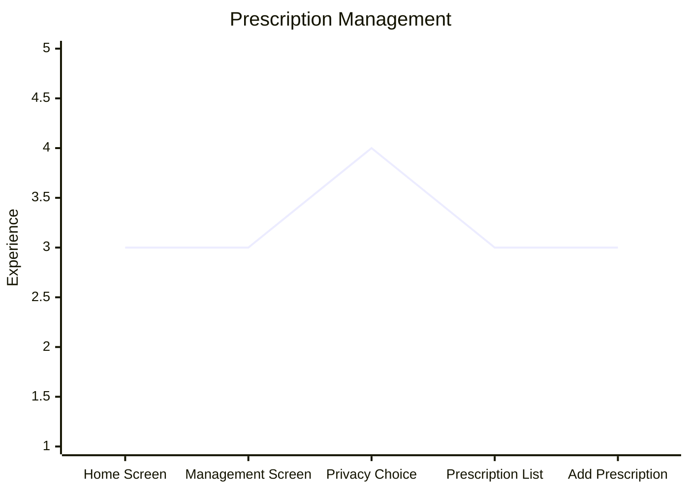

# Prescription Management

| Stage                | Description                                                                               |
| -------------------- | ----------------------------------------------------------------------------------------- |
| 1. Home Screen       | Finds navigation to prescription management; few options, not overwhelming                |
| 2. Management Screen | Sees "View prescriptions" button; clear next step                                         |
| 3. Privacy Choice    | Chooses All or By Doctor (if multiple prescribers); moment of control over what's visible |
| 4. Prescription List | Lands on his list; oriented, ready to add                                                 |
| 5. Add Prescription  | Follows same flow as [Prescription Setup](prescription-setup.md) from stage 3 onward      |

**Note:** "By Doctor" only appears if Denzel has prescriptions from more than one prescriber. If all prescriptions share the same doctor, only "All" is offered — no unnecessary choices.

**Privacy design:** The opt-in view is intentional. Prescriptions are not shown by default when the screen opens, giving Denzel control over what is visible when someone else is nearby. See [issue #26](https://github.com/ianjmacintosh/pillbug/issues/26).
