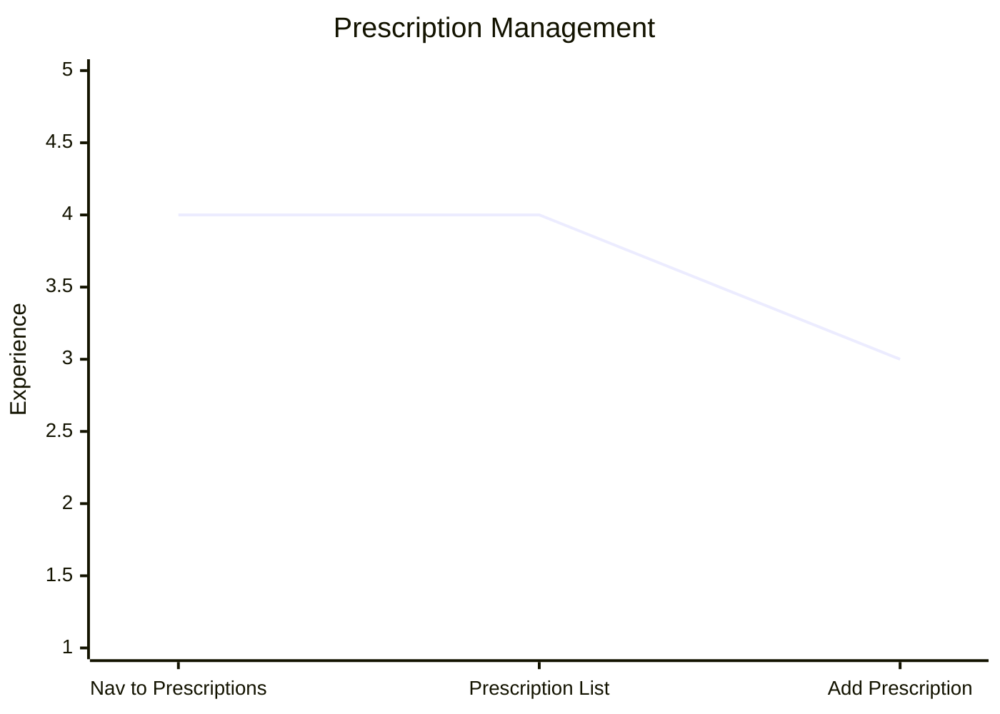

# Prescription Management

| Stage                   | Description                                                                                  |
| ----------------------- | -------------------------------------------------------------------------------------------- |
| 1. Nav to Prescriptions | Patient navigates to `/prescriptions` — the full list loads immediately, no reveal gate      |
| 2. Prescription List    | Patient sees their prescriptions; selects one to view its detail, or taps "Add Prescription" |
| 3. Add Prescription     | Follows the same flow as [Prescription Setup](prescription-setup.md) from stage 3 onward     |

**Empty state:** When a Patient has no prescriptions, the Create Prescription form is shown inline at `/prescriptions` — on desktop in the right panel, on mobile as the full-screen view. No redirect occurs. See ADR-0022.

**Privacy design:** The list loads on mount (no reveal gate — see ADR-0016), but the detail of a specific Prescription is never auto-selected. The Patient must deliberately navigate to a Prescription to see its detail. This preserves choice in "over the shoulder" caregiver scenarios. See ADR-0022.
