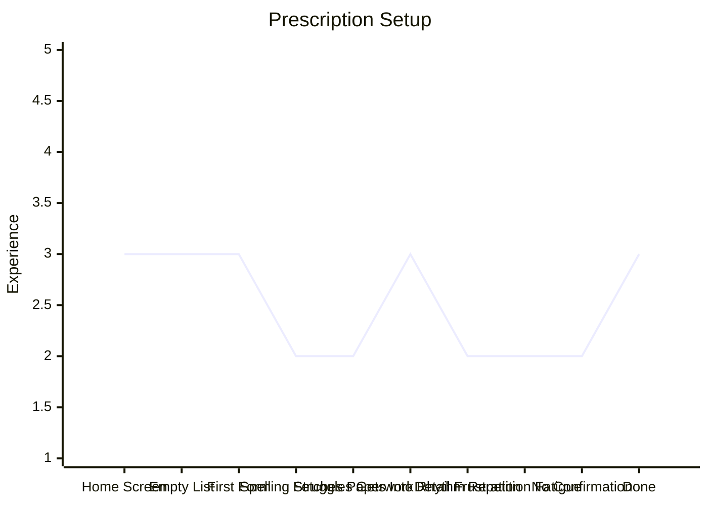

# Prescription Setup

| Stage                 | Description                                             |
| --------------------- | ------------------------------------------------------- |
| 1. Home Screen        | Clear prompt to set up prescriptions; obvious next step |
| 2. Empty List         | Prescription screen shows nothing; slightly daunting    |
| 3. First Form         | Taps "Add Prescription," sees the questions             |
| 4. Spelling Struggles | Stumbles on medication names; uncertainty creeps in     |
| 5. Fetches Paperwork  | Has to stop and find the prescription sheet             |
| 6. Gets Into Rhythm   | Starts moving through entries more confidently          |
| 7. Detail Frustration | Would rather enter a name than mg/dosage specifics      |
| 8. Repetition Fatigue | Entering 10 prescriptions is tedious; energy drops      |
| 9. No Confirmation    | Finished but no clear way to verify everything is right |
| 10. Done              | All 10 entered; relieved but not fully confident        |

**Key risk:** The arc stays low throughout — this is a grind even on the happy path. Medication name autocomplete would address spelling anxiety (stage 4) and could pre-fill dosage details (stage 7), letting Denzel confirm rather than type. A review/confirmation screen at the end addresses stage 9.

**Open design question:** A per-medication confirmation screen (with checkmarks) is a candidate solution for stage 9. Whether the final "all done" action should be a button that appears after all items are checked, auto-advance on the last checkmark, or something else is unknown — needs user testing with Denzel to determine what feels clear vs. confusing.
