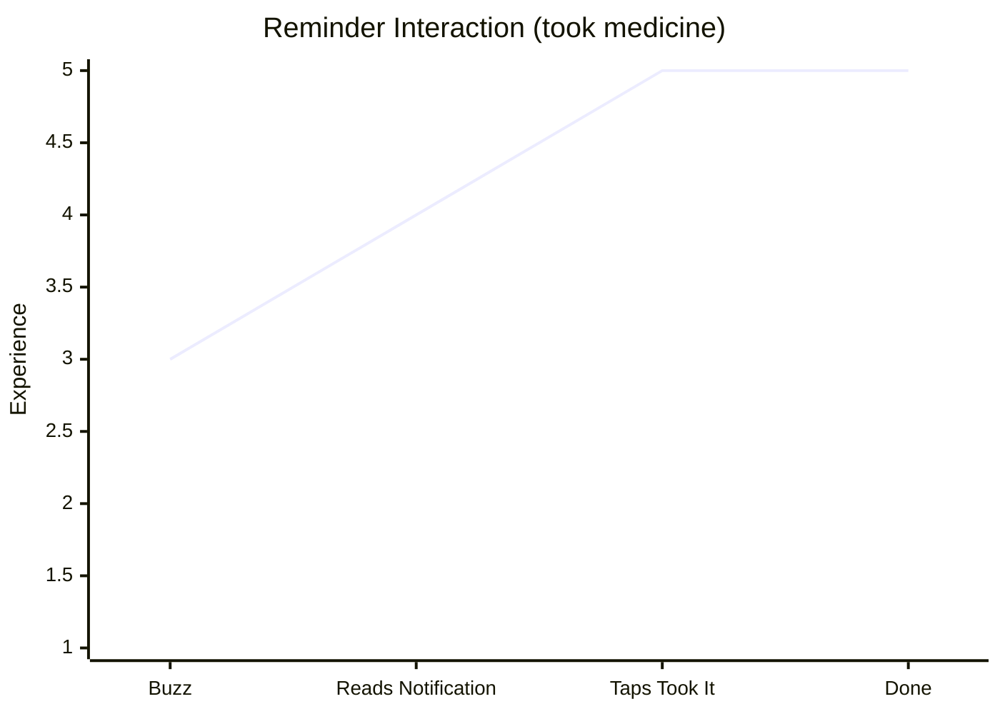

# Reminder Interaction

| Stage                        | Description                                                                                 |
| ---------------------------- | ------------------------------------------------------------------------------------------- |
| 1. Buzz                      | Phone vibrates; Denzel's attention is drawn to it                                           |
| 2. Reads Notification        | Sees prescription name and how many to take; clear and informative                          |
| 3a. Taps "I took it"         | Happy path — done, feels good                                                               |
| 3b. Taps "I did not take it" | Some emotional weight; acceptable given the app's purpose                                   |
| 4b. Second prompt            | Snooze (returns in 9 minutes, unstated) or "I'll mark it later"                             |
| 5b. Snooze                   | Uncertain when reminder returns; mild unease                                                |
| 5c. I'll mark it later       | Dose left unconfirmed; home screen surfaces a prompt for Denzel to return and mark it taken |

**Notification labels:** The second prompt uses "I'll mark it later" rather than "Stop reminding me" to accurately reflect what happens — notifications stop, but the dose remains unconfirmed and resurfaces on the home screen.

**Home screen prompt:** Unconfirmed doses appear on the home screen until resolved. This puts the responsibility on the app to resurface the task rather than on Denzel to remember he deferred it.
